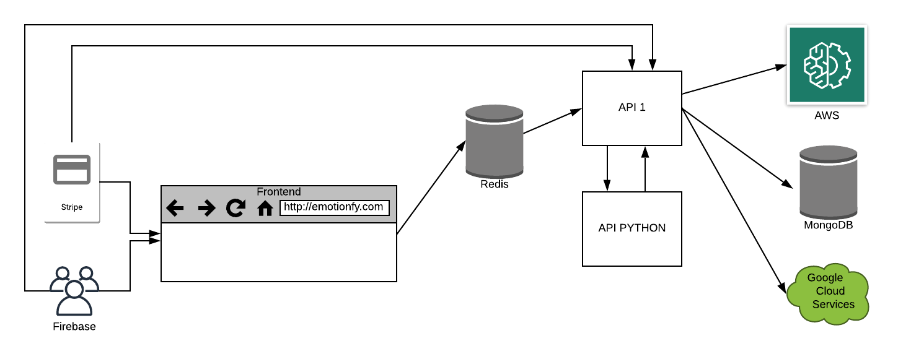

# Emotionfy

##### Integrantes:

1. *Roberto Gervacio Guendulay* - *A01025780* - *Campus Santa Fe*
2. *Emilio Eugenio Gregorio Cantón Bermúdez* - *A01226707* - *Campus Santa Fe*

## 1. Descripción del proyecto

El proyecto seleccionado es una plataforma que permite el análisis de emociones de individuos dentro de un video, usando modelos de Machine Learning. La solución se divide en dos grandes modelos: Face Rekognition de AWS, y un modelo que creamos usando CNNs.

- El modelo de AWS, está ligado con una cuenta "premium": el modelo regresa un video junto con un análisis detallado de las emociones, en diferentes puntos del tiempo
- El modelo de CNN, está ligado con una cuenta "básica": permite subir un video, el análisis se hace cada segundo, pero solo regresa un arreglo de imágenes dibujadas, junto con algunas emociones detectadas.

## 2. Solución

## 2.1 Modelos de bases de datos utilizados

Los tres principales modelos de almacenamiento son MongoDB, junto con Google Cloud Storage; Firebase, para el manejo de usuarios y autenticaciones y Redis, para el desacoplamiento del servicio y mejorar la calidad de la experiencia de usuario al enseñar información relevante al estado del cálculo de emociones.

Al tratarse de un modelo NoSQL, MongoDB permite la flexibilidad de manejar la metadata de los videos como nos convenga. En el ejemplo de los videos "Premium", y los videos "Básicos", podemos modificar la estructura del documento, omitiendo el campo de análisis a detalle de los videos "Básicos".

Por otro lado, utilizamos Firebase como modelo de almacenamiento de usuarios, por que es un framework que se ocupa del hashing de las credenciales de los usuarios, y hace que su administración sea muy sencilla.

Finalmente, utilizamos Redis como modelo de desacoplamiento para mejorar la experiencia del usuario, ya que el proceso de subir el video a la plataforma, dividirlo en frames en un intervalo dado de segundos, mandarlo a alguno de los modelos de Machine Learning, y finalmente guardarlos en Google Cloud Storage es un proceso que toma tiempo, por lo que el usuario podría llegar a frustrarse, ya que no recibiría información en el intermedio.
Para evitar esto, Redis nos permite obtener el estado en el que se encuentra el sistema, y regresárselo al usuario, para que pueda monitorear el proceso.

### 2.2 Arquitectura de la solución



### 2.3 Frontend

#### 2.3.1 Lenguaje de programación

El lenguaje de programación utilizado para la solución es JavaScript, ya que tiene muchas opciones para generar páginas estéticamente agradables, con una gran funcionalidad de peticiones, y de despliegue de la información.

#### 2.3.2 Framework

El framework utilizado es React, el cual permite generar interfaces gráficas interactivas, de forma adaptable y escalable.

### 2.4 Backend

#### 2.4.1 Lenguaje de programación

El lenguaje de programación utilizado para el backend es JavaScript, ya que su amplio soporte con librerías de comunicación con bases de datos, Google Cloud Platform, y Amazon Web Services es útil para integrar todo en un solo proyecto.

#### 2.4.2 Framework

El framework se desarrolló con el método de MERN, entre otros servicios como Google Cloud Storage, Google Firebase, Amazon Web Services (Rekognition) y Stripe.

A continuación están resumidos los endpoints que se utilizaron:

*[Por cada endpoint debe incluir lo siguiente:]*

* **Descripción**:La carga de videos a la plataforma
* **URL**: ```/videos/```
* **Verbos HTTP**: ```POST```
* **Headers**:
* **Formato JSON del cuerpo de la solicitud**:
```json
{
    "user":String,
    "video":File
}
```
* **Formato JSON de la respuesta**:
```json
{
  "video_id":String,
  "duration":Number
}
```
* **Códigos de error**:
    - 500
    - 422

* **Descripción**:La carga del análisis del video a la plataforma
* **URL**: ```/videos/:id```
* **Verbos HTTP**: ```POST```
* **Headers**:
* **Formato JSON del cuerpo de la solicitud**:
```json
{
    "user":String,
    "seconds":Number
}
```
* **Formato JSON de la respuesta**:
```json
{
  'Analysis done'
}
```
* **Códigos de error**:
    - 403


* **Descripción**: Obtención de los videos subidos por el usuario de la sesión activa
* **URL**: ```/videos/```
* **Verbos HTTP**: ```GET```
* **Headers**:
* **Formato JSON del cuerpo de la solicitud**:

~~~json
{
  "user": "String"
}
~~~

* **Formato JSON de la respuesta**:
```json
"payed": {
    "name": "String",
    "path": "String",
    "user": "String",
    "payment_id": "String",
    "local_link": "String",
    "instant": "Number",
    "sequence_id": "Number",
    "bucket_link": "String",
    "analysis": [
    {
      "AgeRange": {
        "High": "Number",
        "Low": "Number"
      },
      "Beard": {
        "Confidence": "Number",
        "Value": "Boolean"
      },
      "BoundingBox": {
        "Height": "Number",
        "Left": "Number",
        "Top": "Number",
        "Width": "Number"
      },
      "Confidence": "Number",
      "Emotions": [
        {
          "Confidence": "Number",
          "Type": {
            "type": "String",
            enum: [ 'HAPPY', 'SURPRISED', 'ANGRY', 'CONFUSED', 'CALM', 'SAD', 'FEAR', 'DISGUSTED' ]
          }
        }
      ],
      Eyeglasses: {
        "Confidence": "Number",
        "Value": "Boolean"
      },
      "EyesOpen": {
        "Confidence": "Number",
        "Value": "Boolean"
      },
      "Gender": {
        "Confidence": "Number",
        "Value": "String"
      },
      "Landmarks": [
      {
        "Type": {
          "type": "String",
          enum: [
            'eyeLeft',
            'eyeRight',
            'mouthLeft',
            'mouthRight',
            'nose',
            'leftEyeBrowLeft',
            'leftEyeBrowRight',
            'leftEyeBrowUp',
            'rightEyeBrowLeft',
            'rightEyeBrowRight',
            'rightEyeBrowUp',
            'leftEyeLeft',
            'leftEyeRight',
            'leftEyeUp',
            'leftEyeDown',
            'rightEyeLeft',
            'rightEyeRight',
            'rightEyeUp',
            'rightEyeDown',
            'noseLeft',
            'noseRight',
            'mouthUp',
            'mouthDown',
            'leftPupil',
            'rightPupil',
            'upperJawlineLeft',
            'midJawlineLeft',
            'chinBottom',
            'midJawlineRight',
            'upperJawlineRight'
          ]
        },
        "X": "Number",
        "Y": "Number"
        }
      ],
      "MouthOpen": {
        "Confidence": "Number",
        "Value": "Boolean"
      },
      "Mustache": {
        "Confidence": "Number",
        "Value": "Boolean"
      },
      "Pose": {
        "Pitch": "Number",
        "Roll": "Number",
        "Yaw": "Number"
      },
      "Quality": {
        "Brightness": "Number",
        "Sharpness": "Number"
      },
      "Smile": {
        "Confidence": "Number",
        "Value": "Boolean"
      },
      "Sunglasses": {
        "Confidence": "Number",
        "Value": "Boolean"
      }
    }
  ]
},
  "free": {
    "user": "String",
    "name": "String",
    "payment_id": "String",
    "metadata": {
    "local_link": "String",
    "bucket_link": "String",
    "video_size": ["Number", "Number"],
    "frame_rate": "Number",
    "duration": "Number"
    },
    "applied_seconds": "Number",
    "frames": [frameSchema],
    "general": {
    "name": "String",
    "emotion": {
    "type": "String",
    "enum": ['HAPPY', 'SURPRISED', 'ANGRY', 'CONFUSED', 'CALM', 'SAD', 'FEAR', 'DISGUSTED']
    },
    "gestures": "Number",
    "link": "String",
    "duration": "Number"
    },
    "gestures": []
  },
  "pending": [
    "id_video" :"String",
    "duration": "Number"
  ],
  "processing": {
    "id_video": {
      "user_id":"String",
      "status":"String"
    } //puede tener varios de estos documentos
  }
}
```

* **Códigos de error**:

- 500

* **Descripción**: Obtención de un video en específico
* **URL**: ```/videos/:id```
* **Verbos HTTP**: ```GET```
* **Headers**:
* **Formato JSON del cuerpo de la solicitud**:

~~~json
{
  "user": String
}
~~~

* **Formato JSON de la respuesta**:
```json
{
  "link": "String", //liga al bucket de GCS
  "name": "String"
}
```
* **Códigos de error**:

- 500
- 404

* **Descripción**: Borrado de un video en específico
* **URL**: ```/videos/:id```
* **Verbos HTTP**: ```DELETE```
* **Headers**:
* **Formato JSON del cuerpo de la solicitud**:

~~~json
{}
~~~

* **Formato JSON de la respuesta**:
```json
{
  'OK'
}
```
* **Códigos de error**:

- 500

* **Descripción**: Checkout de la compra de un video
* **URL**: ```/checkout/```
* **Verbos HTTP**: ```POST```
* **Headers**:
* **Formato JSON del cuerpo de la solicitud**:

~~~json
{
  "payment_intent"
}
~~~

* **Formato JSON de la respuesta**:

```json
{'received'}
```

* **Códigos de error**:

- 500
- 422

- [Firebase Docs](https://firebase.google.com/docs/)
- [Storage Docs](https://cloud.google.com/storage/)
